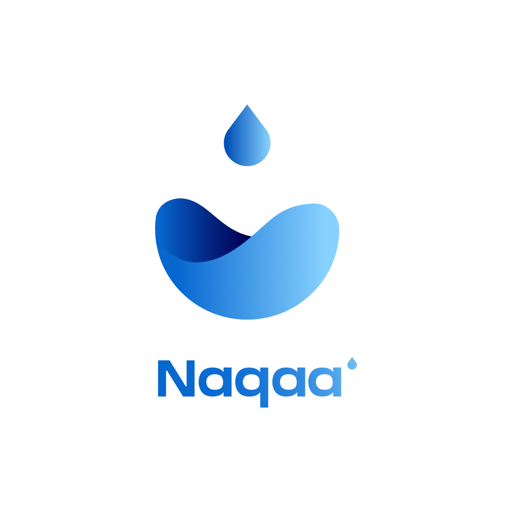
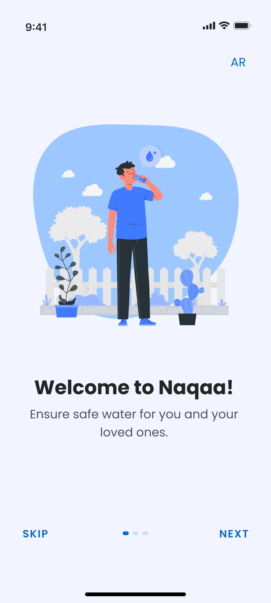
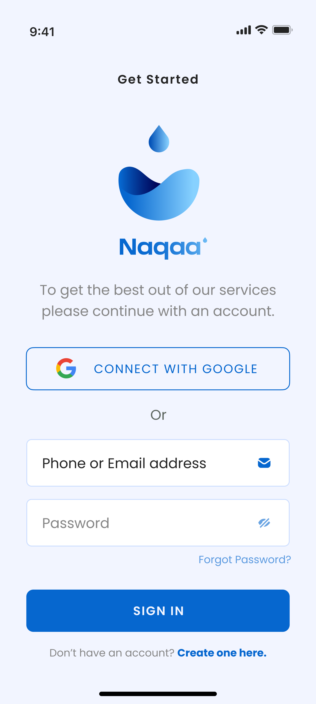
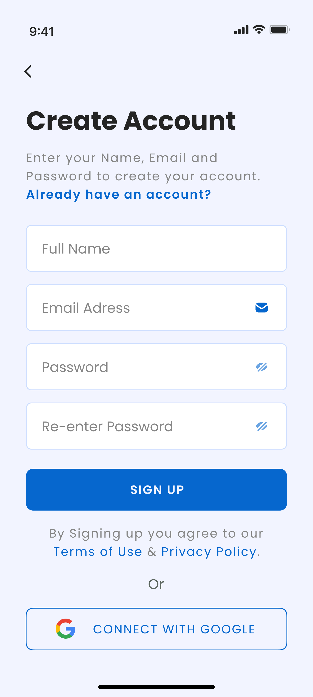
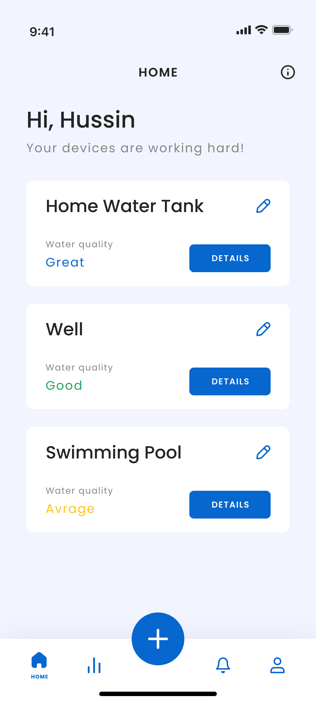
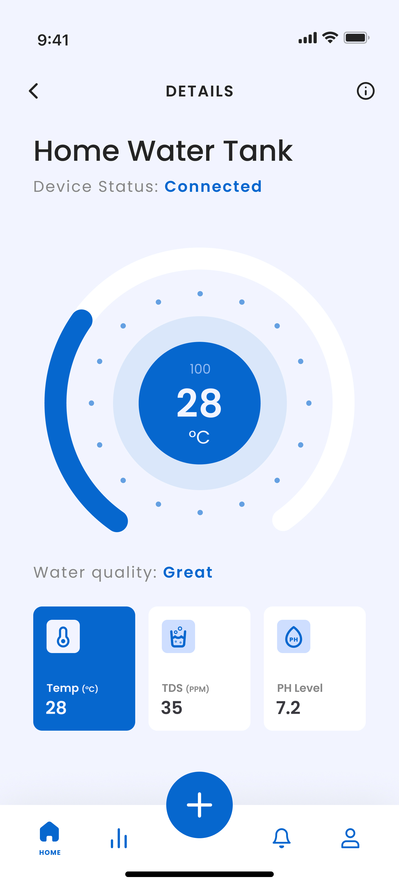
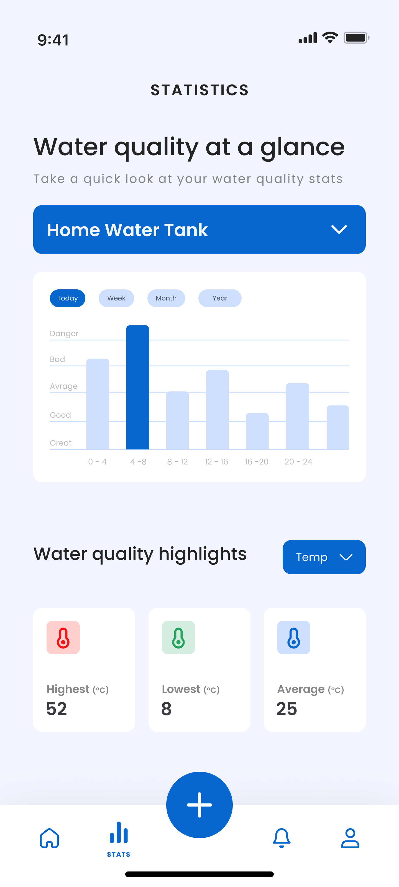
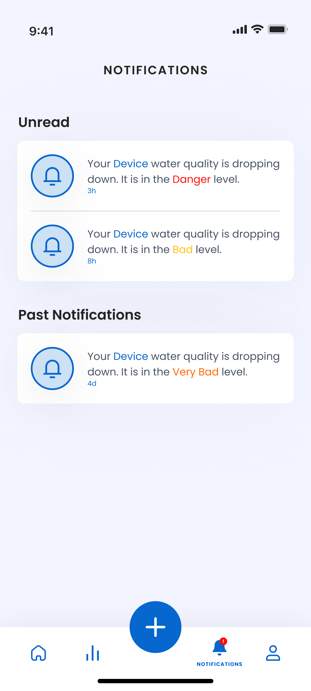
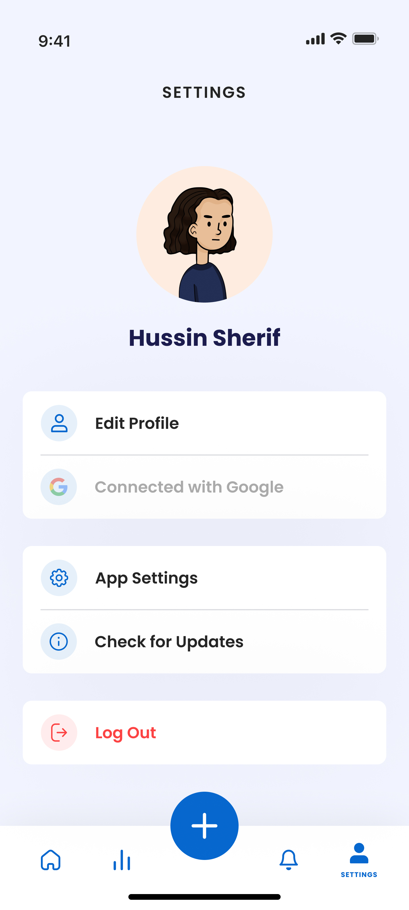

# Naqaa Mobile Application
<p align="center">
  
</p>

<p align="center">
  <strong>A mobile application for real-time water quality monitoring.</strong>
</p>

<p align="center">
  Naqaa provides users with a simple way to view water-quality data, manage monitoring devices, review historical statistics, and receive important notifications.
</p>

---

## Overview

**Naqaa** is a graduation-project mobile application designed to make water-quality information easier to access and understand. The application connects users with water-monitoring devices and presents measurements through a clear, user-friendly interface.

The application supports monitoring three primary water-quality parameters:

| Parameter | Description |
|---|---|
| **pH** | Indicates the acidity or alkalinity of the water. |
| **Temperature** | Displays the recorded water temperature. |
| **TDS** | Displays total dissolved solids in the water. |

The application was developed in the context of Libya’s water-management challenges, including water scarcity, pollution, groundwater depletion, and the need for more accessible water-quality information.

## Features

### Authentication and account management

Users can create an account, log in, reset a forgotten password, edit their personal information, change their password, and log out securely.

### Monitoring-device management

The application allows users to add monitoring devices, assign names to them, view associated devices, rename devices, and remove devices when they are no longer needed.

### Device setup

Naqaa guides users through the device-connection process and supports Wi-Fi provisioning through **ESP-SmartConfig**. The mobile application is responsible for helping users configure and complete the setup of their monitoring devices.

### Real-time monitoring

Users can select a device and view current readings for pH, temperature, and TDS. The monitoring screen is organized to make the status and measurements of each device easy to understand.

### Statistics and historical data

The statistics section allows users to review historical readings over selected time periods. It provides summary values such as the highest, lowest, and average readings, helping users identify trends and changes in water quality.

### Notifications

The application displays notifications and alerts related to changes in water-quality readings so that users can receive important information promptly.

### Settings and information

Users can configure application language and notification preferences, view the terms of use and privacy policy, check application information, and access information about the water-quality parameters.

### Connectivity handling

The application includes a dedicated no-internet-connection state to inform users when full functionality is unavailable because of connectivity problems.

## Application Screens

The documented application flow includes the following screens and areas:

| Area | Purpose |
|---|---|
| **Splash screen** | Introduces the application while it starts. |
| **Onboarding** | Presents the application concept to new users. |
| **Create account** | Allows a new user to register. |
| **Login** | Authenticates an existing user. |
| **Forgot password** | Helps users reset their password. |
| **Device setup** | Guides users through device configuration. |
| **Home** | Lists devices and provides an overview of their readings. |
| **Real-time monitoring** | Displays detailed readings for a selected device. |
| **Statistics** | Shows historical data and summary values. |
| **Notifications** | Displays water-quality alerts and updates. |
| **Settings** | Manages profile, password, language, notifications, and application options. |
| **About Us** | Presents information about the project team. |
| **No internet connection** | Informs users when the network is unavailable. |

## Screenshots

### Onboarding and Authentication

<p align="center">
  
  
  
</p>

### Home and Device Monitoring

<p align="center">
  
  
  
</p>

### Notifications and Settings

<p align="center">
  
  
</p>

## Technology Stack

| Area | Technology | Role in the application |
|---|---|---|
| **Mobile framework** | Flutter | Builds the cross-platform mobile application. |
| **Programming language** | Dart | Implements the Flutter application. |
| **Authentication** | Firebase Authentication | Manages user registration, login, and password recovery. |
| **Structured application data** | Cloud Firestore | Stores and synchronizes application data such as users and devices. |
| **Real-time data** | Firebase Realtime Database | Provides frequently updated monitoring data and device status. |
| **Backend processing** | Firebase Functions | Processes readings, calculates statistics, and supports notifications. |
| **Backend runtime** | Node.js and JavaScript | Supports the Firebase Functions implementation. |
| **UI/UX design** | Figma | Used to design interfaces and interactive prototypes. |
| **Visual design** | Adobe Illustrator | Used to create the application logo, icons, and visual assets. |
| **Source control** | GitHub | Used for version control, collaboration, issue tracking, and documentation. |

## Architecture

The application follows **Clean Architecture**, which separates the codebase into three main layers:

| Layer | Responsibility |
|---|---|
| **Presentation** | Contains screens, widgets, UI states, and user interactions. |
| **Domain** | Contains the core business rules, entities, and use cases. |
| **Data** | Handles repositories, models, Firebase services, and external data sources. |

This separation keeps the user interface independent from the business logic and data-access implementation. It also makes the application easier to maintain, test, and extend.

A typical data flow is:

```text
User interaction
      ↓
Presentation layer
      ↓
Domain use case
      ↓
Repository
      ↓
Firebase service
      ↓
Real-time readings, application data, or notifications
```

## Project Structure

The exact directory names may differ in the final repository, but the application is conceptually organized as follows:

```text
mobile-app/
├── lib/
│   ├── core/              # Shared constants, themes, utilities, and services
│   ├── data/              # Models, data sources, and repository implementations
│   ├── domain/            # Entities, repositories, and application use cases
│   └── presentation/      # Screens, widgets, and UI state management
├── assets/                # Images, icons, fonts, and other application assets
├── test/                  # Unit, widget, and integration tests
├── android/               # Android platform configuration
├── ios/                   # iOS platform configuration
└── pubspec.yaml           # Flutter dependencies and project metadata
```

## Getting Started

The following instructions provide a general setup process. Update the paths, package name, Firebase configuration, and commands to match the final repository before publishing it.

### Prerequisites

Install the following before running the application:

- [Flutter SDK](https://docs.flutter.dev/get-started/install).
- Dart SDK, normally included with Flutter.
- A Firebase project.
- Android Studio or Xcode, depending on the target platform.
- A physical device or emulator.

### Installation

Clone the repository and open the mobile application directory:

```bash
git clone https://github.com/<your-username>/<your-repository>.git
cd <your-repository>
flutter pub get
```

Configure Firebase for the target platform using the appropriate configuration files, such as `google-services.json` for Android or `GoogleService-Info.plist` for iOS. These files should be configured securely and should not be replaced with another developer’s credentials.

Run the application with:

```bash
flutter run
```

## Firebase Services

The mobile application uses Firebase as its supporting cloud platform:

- **Firebase Authentication** manages user accounts and authentication flows.
- **Cloud Firestore** stores structured application information.
- **Firebase Realtime Database** synchronizes monitoring readings and device status.
- **Firebase Functions** process water-quality data, calculate statistics, and support notification workflows.

Do not commit service-account keys, private credentials, passwords, or production secrets to the repository.

## Testing

The project documentation describes testing for the main mobile-application flows, including:

- Empty and required form fields.
- Existing email addresses.
- Invalid input values.
- Invalid login credentials.
- Password-reset instructions.
- Password changes.
- Device setup and authorization.
- Hidden Wi-Fi networks and incorrect network passwords.
- Push and normal notifications.
- First-time-use and empty states.
- No-internet-connection behavior.

Add the final test commands and coverage information here when automated tests are available in the repository.

## Limitations

Naqaa is an academic mobile-application prototype. The application presents data received from connected monitoring devices, but the reliability of the displayed measurements depends on the accuracy, calibration, maintenance, and operating conditions of those devices. The application also requires an internet connection for full access to synchronized data and remote services.

The application should not be treated as a certified laboratory instrument or as a replacement for official water-quality testing.

## Future Improvements

Potential improvements for future versions of the mobile application include:

- Add dashboards for different user roles, such as researchers, organizations, and public institutions.
- Support multiple monitoring locations and map-based device visualization.
- Add offline-first behavior with local caching and synchronization after reconnection.
- Provide more advanced charts and filtering for historical readings.
- Add richer anomaly detection and predictive insights.
- Improve accessibility, localization, and support for additional languages.
- Add stronger privacy controls, role-based access, and audit logs.
- Improve device health, connection-status, and maintenance information within the application.

## Academic Project

Naqaa was developed as a graduation project to explore Flutter mobile development, Firebase integration, real-time data presentation, notification workflows, Clean Architecture, and user-centered interface design.

## License

This project was developed as a graduation project. No license has been specified yet. Add a license file to the repository after confirming the usage and distribution terms with all project contributors.

## References

[1]: https://docs.flutter.dev/ "Flutter Documentation"
[2]: https://firebase.google.com/docs "Firebase Documentation"
[3]: https://docs.github.com/ "GitHub Documentation"

<!-- Project information summarized from Naqaa-ProjectDocumentation-Final.pdf. -->
<!-- Replace the repository URL and add screenshots before publishing. -->

---

<p align="center">
  Built with Flutter and Firebase for accessible water-quality information.
</p> 
